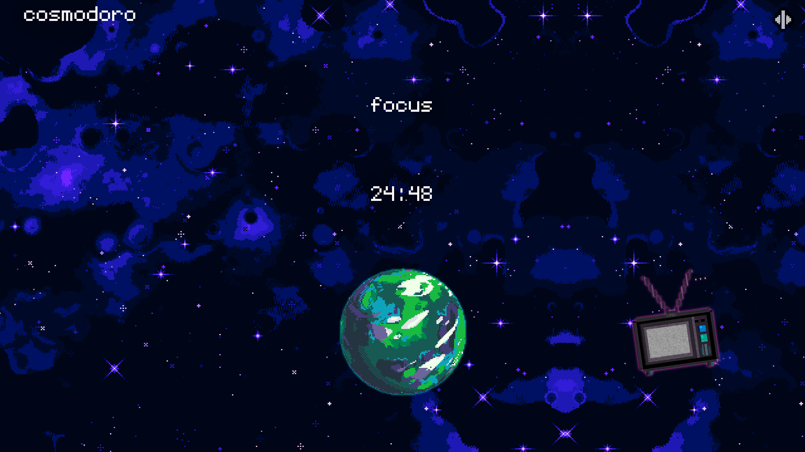

# 🌌 Cosmodoro – A Minimalist, Privacy-Friendly Pomodoro Timer

**Cosmodoro** is a simple and beautiful Pomodoro timer focused on mindfulness, productivity, and respecting your privacy.  
Designed to feel calm, pixel-perfect, and distraction-free.

[🌐 Live Demo](https://cosmodoro-one.vercel.app/)

---

## ✨ Features

- 🕒 Customizable Pomodoro & Break durations  
- 🎨 Stylish pixel-style background animation  
- 🧠 Focus & Break modes with hue-shift  
- 📺 Embedded YouTube player for ambient focus music  
  > *Note: The embedded YouTube player may load cookies or tracking scripts depending on your browser settings.*  
- 🛡️ No invasive tracking – privacy-friendly by default  
- ⚡ Lightweight and fast (Vite + Vue powered)  
- 📱 Responsive & mobile-friendly

---

## 📸 Preview



---

## ⚙️ Customization

You can adjust durations via the settings sidebar (⚙️ icon).  
Perfect for adapting to your own workflow and energy level.

---

## 💡 Philosophy

Cosmodoro is built around **clarity and calm**.  
It avoids clutter, dark patterns, and data collection — so you can focus without distraction.

---

## 🚀 Tech Stack

- [Vue 3](https://vuejs.org)
- [Vite](https://vitejs.dev/)
- [Tailwind CSS](https://tailwindcss.com/)
- TypeScript

---

## 📥 Installation (for devs)

```bash
git clone
cd cosmodoro
npm install
npm run dev
```
